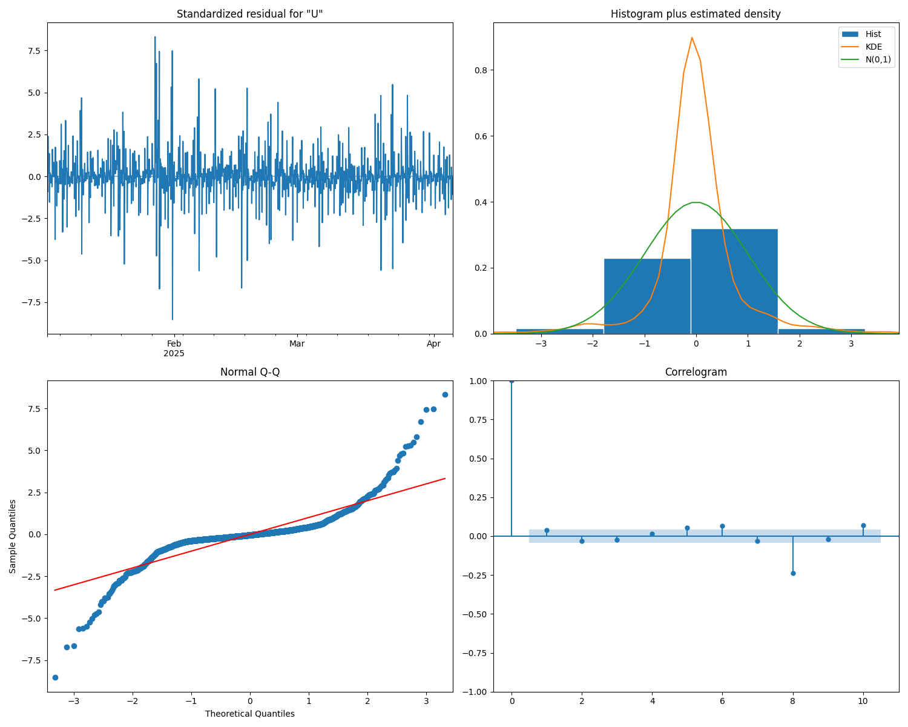

# Water Usage Forecasting with SARIMA Model

This project analyzes and forecasts water usage data using a SARIMA (Seasonal AutoRegressive Integrated Moving Average) model for the period from January 1, 2025 to April 4, 2025.

## Table of Contents
1. [Project Overview](#project-overview)
2. [File Structure](#file-structure)
3. [Functions](#functions)
4. [Execution Results](#execution-results)
5. [Generated Visualizations](#generated-visualizations)

## Project Overview
The project implements a SARIMA model to analyze water consumption patterns from smart meter data and make predictions for future usage. The analysis includes data preprocessing, model training, diagnostics, and forecasting.

## File Structure
```
├── data/
│   └── meter_usages_1743839212343/    # Raw meter usage data files
├── merge_csv.py                        # Script to merge and sort CSV files
├── practive_SARIMA.py                  # Main SARIMA analysis script
├── merged_and_sorted_meter_usages.csv  # Processed input data
├── acf_pacf_plot.png                   # ACF and PACF analysis plot
├── detailed_diagnostics_plot.png       # Model diagnostics visualization
├── extended_forecast_plot.png          # 7-day forecast visualization
└── model_analysis_report.txt           # Detailed model analysis results
```

## Functions

### practive_SARIMA.py Main Functions:

1. `load_and_preprocess_data(file_path)`
   - Loads the CSV data
   - Performs initial data preprocessing
   - Converts data into time series format

2. `analyze_time_series(data)`
   - Calculates basic statistics
   - Performs stationarity test (Augmented Dickey-Fuller)
   - Generates ACF and PACF plots

3. `train_sarima_model(data, order, seasonal_order)`
   - Trains SARIMA model with specified parameters
   - Returns fitted model results

4. `analyze_model_diagnostics(results)`
   - Performs detailed model diagnostics
   - Generates residual analysis
   - Conducts Ljung-Box test
   - Creates diagnostic plots

5. `make_forecast(results, data, steps=48*7)`
   - Generates 7-day forecasts
   - Creates visualization with confidence intervals
   - Returns forecast values

## Execution Results

Key findings from executed.06042025.txt:

1. **Data Overview**:
   - Total observations: 2264
   - Key columns: Household owner, Household Code, Meter Serial, Usage, Value, Last update

2. **Time Series Statistics**:
   - Mean usage: 0.035914
   - Standard deviation: 0.020940
   - Min/Max: 0.000800 / 0.188500

3. **Model Selection**:
   - Best Model: SARIMA(2, 0, 2)x(1, 1, 1, 24)
   - AIC: -13470.443914
   - Log Likelihood: 6742.222

4. **Forecast**:
   - Generated 7-day hourly forecasts (168 steps)
   - Includes 95% confidence intervals

## Generated Visualizations

### 1. ACF and PACF Analysis


This visualization shows:
- Autocorrelation Function (ACF)
- Partial Autocorrelation Function (PACF)
- Helps identify seasonal patterns and correlation structures in the data

### 2. Model Diagnostics


This plot includes:
- Standardized residuals
- Histogram plus estimated density
- Normal Q-Q plot
- Correlogram
- Helps validate model assumptions and fit

### 3. Forecast Visualization


This visualization shows:
- Historical data (last 14 days)
- 7-day hourly forecast
- 95% confidence intervals
- Demonstrates the model's predictive capabilities

### 4. Box Plot Analysis


This visualization shows:
- Distribution of water usage across different time periods
- Identifies outliers and extreme values
- Shows the median, quartiles, and range of water consumption
- Helps understand the variability and patterns in water usage data
- Useful for detecting unusual consumption patterns or potential meter issues

# Phân tích Biểu đồ Box Plot - Mức tiêu thụ nước hàng giờ

## Phân tích chi tiết:

### 1. Xu hướng trung tâm (Median - Trung vị)

* **Đường kẻ ngang đậm bên trong hộp** là giá trị Trung vị (Median hay Q2). Nhìn vào trục Y, đường này nằm ở khoảng **0.032**.
* *Ý nghĩa:* Một nửa (50%) số giờ trong 4 tháng có mức tiêu thụ nước thấp hơn hoặc bằng **0.032**, và nửa còn lại cao hơn hoặc bằng **0.032**. Đây là mức tiêu thụ "điển hình" nhất.

### 2. Độ trải rộng (Spread/Dispersion)

* **Hộp (Box):** Kéo dài từ Q1 (cạnh dưới) đến Q3 (cạnh trên).
    * Cạnh dưới (Q1) nằm ở khoảng **0.022**.
    * Cạnh trên (Q3) nằm ở khoảng **0.048**.
    * => **Khoảng tứ phân vị (IQR)** = Q3 - Q1 ≈ 0.048 - 0.022 = **0.026**.
* *Ý nghĩa (Hộp):* 50% số giờ tiêu thụ "ở giữa" (không tính 25% thấp nhất và 25% cao nhất) có mức dùng nước nằm trong khoảng từ **0.022 đến 0.048**. Độ dài của hộp (0.026) cho thấy một sự biến động nhất định trong nhóm giờ tiêu thụ phổ biến này.

* **Râu (Whiskers):**
    * Râu dưới kéo dài từ Q1 (≈0.022) xuống đến gần **0.000** (hợp lý vì mức tiêu thụ không thể âm).
    * Râu trên kéo dài từ Q3 (≈0.048) lên đến khoảng **0.085**.
* *Ý nghĩa (Râu):* Phần lớn các giá trị "thông thường" (không kể ngoại lai) nằm trong khoảng từ gần **0 đến 0.085**. Độ dài của râu trên lớn hơn râu dưới đáng kể.

### 3. Tính đối xứng / Độ lệch (Symmetry/Skewness)

* **Vị trí Trung vị trong hộp:** Đường trung vị (≈0.032) nằm **gần với Q1 (≈0.022) hơn** là Q3 (≈0.048). Phần trên của hộp (Median đến Q3) dài hơn phần dưới (Q1 đến Median).
* **Độ dài Râu:** Râu trên (từ Q3 đến ≈0.085) **dài hơn hẳn** râu dưới (từ Q1 đến ≈0).
* *Ý nghĩa:* Cả hai yếu tố này đều cho thấy rõ ràng rằng dữ liệu bị **lệch phải (positively skewed)**. Điều này có nghĩa là: đa số các giờ có mức tiêu thụ nước tập trung ở mức thấp và trung bình (dưới 0.048), nhưng có một số ít giờ tiêu thụ nước cao hơn hẳn và kéo dài sự phân bố về phía bên phải (phía giá trị cao). Điều này khớp với việc giá trị `mean` (≈0.036) lớn hơn `median` (≈0.032) mà chúng ta thấy trong thống kê.

### 4. Giá trị ngoại lai (Outliers)

* Có **nhiều điểm tròn nhỏ** được vẽ phía trên râu trên. Các điểm này nằm trong khoảng từ **0.09 đến gần 0.19**.
* *Ý nghĩa:* Đây là những giờ có mức tiêu thụ nước **cao bất thường** so với đại đa số các giờ khác trong 4 tháng (cao hơn ngưỡng `Q3 + 1.5 * IQR` ≈ 0.087). Chúng đại diện cho những thời điểm tiêu thụ nước rất cao của hộ gia đình (có thể là tưới cây, giặt giũ nhiều, rửa xe, hoặc các hoạt động dùng nhiều nước khác). Sự tồn tại của nhiều outliers này càng củng cố kết luận về tính lệch phải của dữ liệu.

## Kết luận chung từ Box Plot:

Biểu đồ Box Plot này cung cấp một cái nhìn tổng quan rất tốt về dữ liệu tiêu thụ nước:

* Mức tiêu thụ **điển hình (trung vị)** là khoảng **0.032** đơn vị/giờ.
* Mức tiêu thụ **phổ biến nhất (50% ở giữa)** nằm trong khoảng **0.022 đến 0.048** đơn vị/giờ.
* Dữ liệu **không đối xứng**, mà bị **lệch hẳn về phía giá trị cao (lệch phải)**. Đa số thời gian dùng ít hoặc vừa phải, nhưng có những lúc dùng nhiều hơn đáng kể.
* Có **nhiều giờ tiêu thụ cao bất thường (outliers)**, lên đến gần **0.19** đơn vị/giờ, cần được lưu ý.

## Installation

```bash
python3 -m venv .venv
source .venv/bin/activate
(.venv) kienle@KienLePC:~/workspace/lab/sarima_lab1$ pip install pandas numpy matplotlib seaborn statsmodels scikit-learn
deactivate
```

## Run

```bash
source .venv/bin/activate && python practive_SARIMA.py
```
